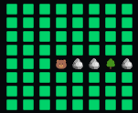
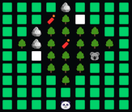
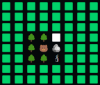

# Bears Against Time CPP

Implementation of a terminal game in C++ where you play as the bears from We Bare Bears

## Inspiration

The game being implemented is the same game I was made to implement in the first programming class I took in the university of Buenos Aires (Algorithms and Porgramming I), where it was developed using the C programming language. The proyect is in spanish and can be found [here](https://github.com/RafaB15/Algoritmos-1-TP2-Osos-contra-reloj).

Since I never really used C++, and given that it is a superset of C, I decided that I would re-implement the proyect but changing the paradigm from **procedural programming** to **object oriented programming**.

## Instructions

The game starts by asking you a few questions to see which of the three bears from *We Bear Bears* you are (Grizzly, Panda or Ice). 

After that, you will be in the map with all the tiles hidden except for yourself. The **objective** of the game is to find your friend Chloe in less than 2 minutes. 

The actions you can use are:

- **A**: Move left.
- **D**: Move right.
- **W**: Move up.
- **S**: Move down.
- **F**: Use the flashlight. It will show all the elements in the map in the direction you are facing. It lasts an amount of movements dependent on the battery.

    
- **R**: Use the fireworks. They will light up a random part of the map 3 times.

    

- **C**: Use the candle. It will ligt up the surrounding tiles. It lasts five movements.

    

In the map you will find the following obstacles:

- **Tree 🌳**: Adds one second to the time lost.
- **Rock 🪨**: Adds 2 seconds to the lost time.
- **Koala 🐨**: Will take you to a random position in the first column. Every time you turn your flashlight on a new Koala appears on the map.

And the following tools:

- **Fireworks 🧨**: Adds a firework to your inventory.
- **Candle 🕯️**: Adds a candle to your inventory.
- **Battery 🔋**: Adds 5 movements to your flashlight.

The characters are the following:

- **Grizzly Bear 🐻**: 
    - Starts with 15 movements in the flashlight.
    - Starts with 4 candles.
    - Adds half a second of lost time for every tree encountered instead of 1.
- **Panda Bear 🐼**:
    - Starts with 10 movements in the flashlight.
    - Starts with 4 candles.
    - Starts with 2 fireworks.
- **Ice Bear 🧊**:
    - Starts with 10 movements in the flashlight.
    - Starts with 6 candles.
    - Doesn't add any lost time for the rocks encountered.
    - When the obstacles in the map that he has encountered amount to 30 seconds of lost time, reveals Chloe's location.

## Execution

The program is compiled with the `g++` compiler. 

### Compilation

There is a **makefile** included to make the compilation easier. You have to execute `make` in the command line to generate the executable. If you want to deleate it, you can use `make clean`.

### Execution

To execute the game you have to run the executable introducing `./bears_against_time` in the command line.